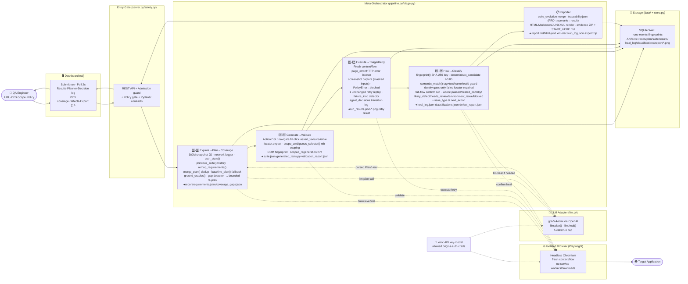
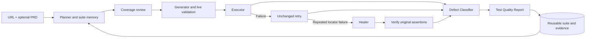

# Autonomous Test Orchestration Agent

**Give a website URL. Get a reusable test suite, verified locator repairs, and a Test Quality Report with browser evidence.**

**Planner → Generator → Executor → Healer → Defect Classifier**, evaluates coverage between stages, and records why it reused, extended, retried, repaired or escalated a test.

The focus is maintaining useful tests as a website changes. Repeat runs retain scenario IDs and expected results. Locator drift can be repaired after verification; changed expected behavior remains visible as a failure requiring investigation.

## High-level architecture

The pipeline runs **nine sequential stages**. Each stage is a distinct agent decision point — Python code controls every transition; OpenAI is called only for planning and constrained locator repair.



> **Key design choices:** single Python process · one active `asyncio` task · no LangGraph / Redis / Docker · all stage transitions decided by Python code · OpenAI called ≤ 5×/run (plan + optional re-plan + optional heal) · every locator repair must pass a semantic identity gate and a full-flow confirmation before the suite is updated.

## Agent roles

Each stage in the pipeline is an **autonomous decision node**. The meta-orchestrator in `pipeline.py` drives transitions; no agent calls another directly.

| # | Agent | Module(s) | What it does |
|---|---|---|---|
| 1️⃣ | **Explorer** | `browser.py · crawl()` | Launches a headless Chromium session and crawls the target URL up to the configured page budget. At each page it runs a DOM snapshot (visible elements, text, links) and records network blocks. Outputs `recon.json` used by all downstream agents. |
| 2️⃣ | **Planner** | `planning.py · evolution.py · llm.py` | Loads the previous completed suite from SQLite (if any), remaps PRD requirements to surviving flows, deduplicates by action signature, then calls `llm.plan()` to generate new scenarios grounded in the recon evidence. Falls back to `baseline_plan()` when no OpenAI key is configured. |
| 3️⃣ | **Coverage Checker** | `planning.py · coverage()` | Audits every requirement for a linked test, checks that assertions are quoted literals (`ground_oracles()`), and detects missing negative/boundary/business-flow scenarios. If fixable gaps exist it triggers **one bounded re-plan** before locking the suite. |
| 4️⃣ | **Generator** | `pipeline.py · export_suite()` | Serialises the validated `Plan` model to `suite.json` and writes `generated_tests.py` (a replay entry-point). Action DSL emitted: `navigate · fill · click · assert_text · assert_url · assert_visible`. No model-generated Python is ever evaluated — all actions stay in typed JSON. |
| 5️⃣ | **Validator** | `browser.py · execute_flow(validation)` | Replays each flow once before full execution to verify locators exist in the live page state. Ambiguous repeated selectors are automatically scoped to the nearest verified text anchor (`scope_ambiguous_selector()`). Captures DOM fingerprints for the Healer. |
| 6️⃣ | **Executor** | `browser.py · execute_flow(run)` | Runs every flow in a **fresh isolated browser context** (no shared cookies or state). Records page errors, HTTP-error responses, and a masked screenshot per flow. PolicyErrors (password fill, payment click) surface as `blocked` — not a test failure. |
| 7️⃣ | **Triage / Retry** | `triage.py · triage_flow()` | On any failure, immediately reruns the flow **unchanged once** to distinguish a transient glitch from a real failure. Detects whether the failure kind (`selector · assertion · execution`) and step index are identical across both attempts before routing to the Healer. Records every decision in `agent_decisions`. |
| 8️⃣ | **Healer** | `healing.py · pipeline.py · repair()` | Activated only on a repeated, identical selector failure. Tries a **deterministic fingerprint match** first (similarity ≥ 0.85, unique winner). Falls back to `llm.heal()` only if deterministic repair fails. A strict **semantic identity gate** ensures the repaired element has the same tag, text, name, or test-id. The full flow is then replayed with all original assertions; the suite is updated only on confirmation. |
| 9️⃣ | **Defect Classifier** | `healing.py · classify()` `triage.py · defect_report()` | Assigns one of seven outcome labels to every scenario: `passed · healed_ok · flaky_test · likely_defect · needs_review · environment_issue · blocked`. Each label includes a confidence score and a `next_action` recommendation for the engineer. |
| 📋 | **Quality Reporter** | `reporting.py · reports()` | Aggregates results, PRD traceability, suite evolution (reused / added / regressed), heal evidence and coverage gaps into `report.md`, `report.html`, `junit.xml`, and an evidence ZIP with `START_HERE.md`. |

## For the jury: start here

| Read | What it answers |
|---|---|
| [Jury and demo guide](docs/JURY_GUIDE.md) | What to demonstrate in five minutes and how to interpret the results |
| [Architecture](docs/ARCHITECTURE.md) | Components, orchestration, browser isolation and data flow |
| [Technology decisions](docs/TECHNOLOGY_DECISIONS.md) | Why this stack, why no LangGraph, examples and trade-offs |
| [Implemented features](docs/FEATURES.md) | What each feature actually does |
| [PDF alignment and self-healing](docs/SELF_HEALING_AND_PDF_ALIGNMENT.md) | Requirement mapping, reuse rules, repair gates and limitations |
| [Verification](docs/VERIFICATION.md) | Measured results, reproducible checks and unresolved observations |
| [Report guide](docs/REPORT_GUIDE.md) | How to read the ZIP, classifications and repair evidence |
| [Implementation roadmap](docs/IMPLEMENTATION_PLAN.md) | Delivered milestones and future engineering work |

## Run locally

Prerequisites: **Python 3.12** and Chromium installed through Playwright. OpenAI mode needs your own API key and network access. Baseline needs no model key. Windows is the verified environment; Linux/macOS instructions are supplied but were not acceptance-tested here.

From the repository root in PowerShell:

```powershell
python -m venv .venv
./.venv/Scripts/python.exe -m pip install -r requirements.txt
./.venv/Scripts/python.exe -m playwright install chromium
if (!(Test-Path .env)) { Copy-Item .env.example .env }
```

Set `OPENAI_API_KEY` privately in `.env`. `OPENAI_MODEL` is configurable; the example uses `gpt-5.4-mini`. Model access depends on your account. Keep `.env` private.

```powershell
./.venv/Scripts/python.exe run.py
```

Open **[http://127.0.0.1:8765](http://127.0.0.1:8765)** and check runtime readiness under **Configuration**. On subsequent launches, `./start.ps1` starts the application. Stop with **Ctrl+C** before starting another instance. Do not use multiple workers or Uvicorn `--reload` with this Windows browser process.

On Linux/macOS, create the environment with `python3 -m venv .venv` and use `.venv/bin/python` instead. Linux may require `.venv/bin/python -m playwright install --with-deps chromium`.

## First run

1. Click **Try a demo**, then start the baseline. It executes real Chromium checks against the included Fieldnotes shop without AI calls.
2. For business-flow planning, choose **New test run → OpenAI · Business-flow planning** and enter a test URL.
3. Optionally upload [the example Markdown PRD](examples/fieldnotes-prd.md) and enter a focus area. Enable **Allow clicks and form input** for the example cart, search and coupon scenarios.
4. Set the visible **Scenario budget** (maximum cases planned), and the **Page budget** under Advanced details (distinct pages explored). Both support 1?12; defaults are five pages and six cases. Increasing the scenario budget allows an unchanged suite to grow. Unsupported remaining scenarios are reported as a shortfall.
5. Inspect **Results**, **Planner**, **Decision log**, **PRD coverage & risks**, **Defect Classifier**, and **Changes & repairs**.
6. Choose **Export evidence**, unzip it, read **START_HERE.md**, and open **report.html**. The [report guide](docs/REPORT_GUIDE.md) explains the artifacts.
7. **Run again** preserves the URL, policy, focus and PRD. Matching scenarios are reused; new evidence or PRD gaps can trigger additions within the budget.

**Baseline checks observed content. OpenAI plans business flows.** A completed run means orchestration finished, not that every test passed. A 100% scenario pass rate does not mean full application coverage.

## What makes it agentic?



The Python meta-orchestrator chooses transitions from browser evidence and coverage gaps. A repair changes only a uniquely identified failed locator, then replays the complete flow. Ambiguous repairs and changed business expectations are escalated. **LangGraph is not installed**; [Technology decisions](docs/TECHNOLOGY_DECISIONS.md) explains why and when it would become useful.

## Verified behavior

- **36 unit/API/lifecycle tests passed** on Windows.
- A controlled browser sequence verified locator repair, reuse of that repair, preservation of a content regression, and a new scenario for a newly discovered page.
- PRD upload, classifier/change tabs, mobile width and JavaScript-error checks passed.
- The final end-to-end run passed the dashboard-created baseline (2/2), generated-suite replay, local interactions, repair/classifier fixtures, authenticated SauceDemo baseline (1/1), and cancellation.
- Two live OpenAI PRD runs demonstrated **two scenarios retained and one added**. The first passed **1/2** cases; the second passed **2/3**. An unsupported placeholder-text assertion remained unresolved in both. This is a documented limitation, not an application defect claim.

See [Verification](docs/VERIFICATION.md) for exact scope and records. Generated plans can vary across runs and model versions.

## Test and replay

```powershell
./.venv/Scripts/python.exe -m pytest -q
# Start run.py before browser acceptance checks:
./.venv/Scripts/python.exe -m scripts.verify_evolution
# Optional live OpenAI check; incurs API usage:
./.venv/Scripts/python.exe -m scripts.verify_prd_ai
# Replay an exported suite from this repository without planning calls:
./.venv/Scripts/python.exe -m qa_agent.replay "path/to/extracted/suite.json"
```

Other targeted checks cover local interactions, network compatibility and authenticated SauceDemo; see [Verification](docs/VERIFICATION.md). Replay needs this project's interpreter, dependencies, browser and local authentication. The ZIP is not a standalone browser installer.

## Target access and operating limits

`QA_ALLOWED_ORIGINS=*` admits HTTP(S) targets. Authentication, CAPTCHA/MFA, cross-domain journeys, dynamic state, canvas and inaccessible content can still limit testing. Compatible loading supports external read resources; navigation remains constrained. Additional navigation origins remain an API compatibility option, not a dashboard field.

For SauceDemo, use `https://www.saucedemo.com/inventory.html`. Open **New test run → Advanced details → Sign in before testing** and enter the username and password. Only username and password are required. The agent detects the login form (including a visible sign-in link or a username-first flow), submits it, and checks that the session works in a fresh browser context. The application URL can be a protected page or its login page. Ambiguous forms fail with an actionable error. Login must stay on the application origin. Credentials are held for the run, excluded from saved requests and exports, and must be re-entered for repeat runs. Login runs independently of the test interaction checkbox. MFA, CAPTCHA and external identity providers may require a pre-authenticated `QA_STORAGE_STATE`. Same-origin password forms work automatically, including forms hosted at `/sso/login`.

Alternatively, set credentials privately in `.env` with `TARGET_AUTH_ORIGIN=https://www.saucedemo.com`, `TARGET_USERNAME`, `TARGET_PASSWORD`, and optionally `TARGET_LOGIN_PATH` / `TARGET_*_SELECTOR` overrides (leave these blank for automatic detection). This remains the fallback when per-run sign-in is unchecked and is used by exported replay scripts. No credentials are committed. Authenticated page content and screenshots may still contain account data.

Limits: **one local user, one active run, Chromium, ten minutes, five logical model calls**. Each SDK call can retry once. A failed scenario gets one unchanged execution retry and at most one locator repair with confirmation. Interactions can repeat during validation and retry; use resettable test data. Payments, destructive actions and order completion are blocked by the current policy.

This is a working local hackathon implementation. Multi-user hosting, distributed execution, CI/CD integration, arbitrary flow repair and complete production coverage are not delivered features.

## Troubleshooting and data

| Symptom | Action |
|---|---|
| Browser missing | Run the Playwright Chromium installation command. |
| `[WinError 5] Access is denied` | Start in a normal local PowerShell terminal; check folder/browser permissions. Inspect Configuration and `runtime_error.json`. The application cannot bypass OS policy. |
| Port already in use | Stop the existing server. `scripts/restart_local.ps1` is a helper for an idle local server. |
| OpenAI key/model error | Check private `.env`, account access and connectivity, then restart. Baseline needs no key. |
| Protected page unavailable | Configure target-specific authentication; review crawl gaps. |
| Settings not reflected | Restart and refresh the dashboard. |

`data/` stores SQLite history, PRDs, screenshots and reports. It is gitignored, not encrypted. Stop the server before backing up the entire directory. Retention is manual. Optional token prices in `.env` enable estimates; unset prices remain unavailable. Timed-out calls can still incur provider charges.

## Repository map

```text
qa_agent/      API, planner, browser, Healer, persistence and reports
ui/            Dashboard HTML/CSS/JavaScript; no frontend build step
demo/          Fieldnotes test application
scripts/       Startup, readiness and acceptance checks
tests/         Unit, API, lifecycle and repair-invariant tests
examples/      Optional Markdown PRD
docs/          Jury guide, architecture, decisions, evidence and roadmap
docs/archive/  Original research, separated from implementation claims
data/          Local generated evidence and state; ignored by Git
```

The [original research](docs/archive/ORIGINAL_RESEARCH.md) is retained as provenance. Its proposed stack and numerical claims are not the specification of the running implementation.

Page discovery waits for SPA loading within a bounded timeout, deduplicates redirected URLs, and prioritizes main content in snapshots. New initial-page selectors are checked against observed evidence before execution. Known blocked analytics requests remain in recon diagnostics but do not imply missing application content. These checks improve general website support; they do not guarantee complete coverage or compatibility with every website.
